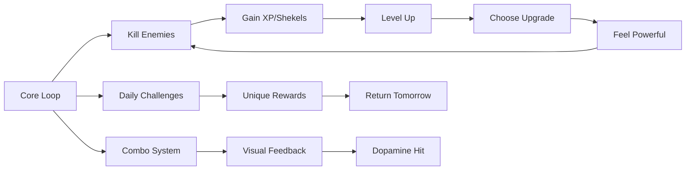

# Sababa Survivor A1 Upgrade Plan

## Executive Summary
Transform Sababa Survivor from a fun prototype into a viral A1 title by fixing critical bugs, implementing modern performance techniques, and creating an authentically immersive Jewish gaming experience.

---

## Critical Issues Identified

### 1. Enemy Spawning Bug (HIGH PRIORITY)
**Problem**: Enemies spawn at a fixed distance from player without checking building collision, causing enemies to get stuck inside buildings.

**Root Cause** (lines 5597-5616):
```javascript
function spawnEnemy() {
    const angle = Math.random() * Math.PI * 2;
    const dist = Math.max(W, H) / 2 + 150;
    enemies.push({
        x: player.x + Math.cos(angle) * dist,  // No building check!
        y: player.y + Math.sin(angle) * dist,
        // ...
    });
}
```

**Solution**: Implement safe spawn validation using the existing `buildingGrid` spatial index.

---

## Performance Architecture

```mermaid
graph TD
    A[Game Loop] --> B[Update Phase]
    A --> C[Render Phase]
    
    B --> D[Spatial Grid Updates]
    B --> E[Staggered Enemy Updates]
    B --> F[Physics Web Worker]
    
    C --> G[Offscreen Canvas Layering]
    C --> H[LOD System]
    C --> I[Viewport Culling]
    
    G --> J[Static World Cache]
    G --> K[Dynamic Entities]
    
    D --> L[O(1) Collision Lookups]
    F --> M[Background Physics]
    
    style A fill:#4ECDC4,stroke:#2A9D8F
    style B fill:#FFD700,stroke:#FF8C00
    style C fill:#FF6B6B,stroke:#E63946
```

### Modern Performance Techniques to Implement

1. **Web Workers for Physics**: Move collision detection off main thread
2. **Offscreen Canvas Layering**: Pre-render static buildings/ground
3. **Frame Skipping**: Update distant enemies every 2-3 frames
4. **LOD System**: Simplified rendering for distant enemies
5. **Delta Time Smoothing**: Prevent frame spike lag

---

## Jewish World Immersion Enhancements

### Authentic Israeli Environment
| Element | Implementation | Priority |
|---------|---------------|----------|
| Tel Aviv Beach | Matkot players, umbrellas, sunbathers | High |
| Landmarks | Azrieli towers silhouette, beachfront | Medium |
| Food Pickups | Falafel 🧆, Rugelach 🥐, Bamba 🥜 | High |
| Hebrew Voice Lines | "Yalla!", "Sababa!", "Chai!" | Medium |
| Day/Night Cycle | Sunset over Mediterranean | Medium |
| Holiday Events | Purim masks, Hanukkah menorah drops | Low |

### Audio Enhancements
- Expand klezmer music with multiple tracks
- Add authentic Israeli sound effects (shofar, matkot ball hits)
- Dynamic music intensity based on enemy count

---

## Addictive Gameplay Mechanics

### Progression Systems


### New Mechanics
1. **Combo System**: Kill streaks multiply XP, show floating combo counter
2. **Weapon Evolution**: Visual changes at levels 5, 10, 15
3. **Mini-Bosses**: Every 2-3 minutes, guaranteed upgrade drops
4. **Risk/Reward Zones**: Dangerous areas with 2x XP
5. **Daily Challenges**: "Kill 50 pigs with Shofar" - unique rewards

---

## Implementation Phases

### Phase 1: Critical Bug Fixes (Week 1)
- Fix enemy spawning on buildings
- Add stuck enemy detection/teleport
- Optimize spatial grid queries

### Phase 2: Performance Foundation (Week 1-2)
- Implement offscreen canvas for static world
- Add frame skipping for distant enemies
- Delta time smoothing

### Phase 3: Immersion & Polish (Week 2-3)
- Add authentic Israeli environment details
- Expand audio system
- Visual effects overhaul

### Phase 4: Addictive Mechanics (Week 3-4)
- Combo system
- Daily challenges
- Weapon evolution

### Phase 5: Mobile & Launch Prep (Week 4)
- Touch controls
- Settings menu
- Trailer sequence

---

## Technical Specifications

### Performance Targets
- **60 FPS** on mid-range devices
- **< 16ms** frame time consistently
- **< 100MB** memory usage
- **< 3s** initial load time

### Browser Compatibility
- Chrome/Edge 90+
- Firefox 88+
- Safari 14+
- Mobile Safari/Chrome

---

## Success Metrics

### Engagement
- Average session time > 10 minutes
- Day 1 retention > 40%
- Day 7 retention > 15%

### Performance
- Zero FPS drops below 45
- No enemy spawning bugs
- Smooth mobile experience

### Virality
- Share rate > 5%
- Organic growth through word-of-mouth
- Featured on gaming showcase sites
